# Mini Grep Tool

A simplified version of the `grep` command with case-insensitive search and filtering options.

## Features
- 🔍 Case-insensitive string search
- 🔢 Line number display (`-n` option)
- 🔄 Inverted matching (`-v` option)
- 🧩 Combined flags (`-vn` or `-nv`)
- ❓ Help documentation (`--help`)

### 1. Making the Script Executable

### 2. Basic Case-Insensitive Search

#### Finds both "Hello" and "HELLO" (case-insensitive)

### 3. Search with Line Numbers
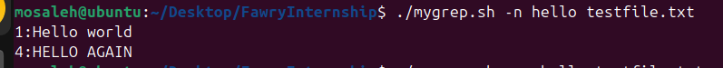

#### Shows matching lines with their line numbers

   
### 4. Inverted Match with Line Numbers
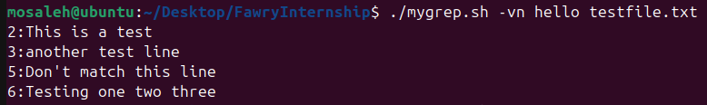

#### Shows lines that DON'T contain "hello" with line numbers

### 5. Error Handling
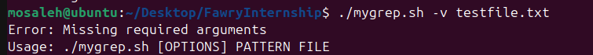

#### Properly handles missing arguments

### 6. Simple Inverted Search
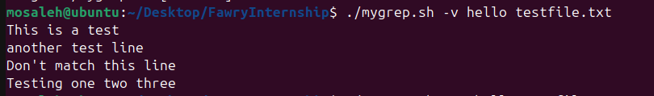

#### Shows all lines that don't contain "hello"

### 7. Combined Flags Demonstration
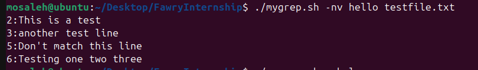

#### Demonstrates that flag order doesn't matter (-nv same as -vn)

### 8. Help Documentation
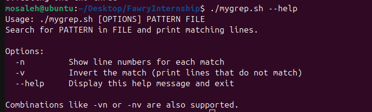

#### Shows clear usage instructions

    

# Fawry Internship Project - SCenario 

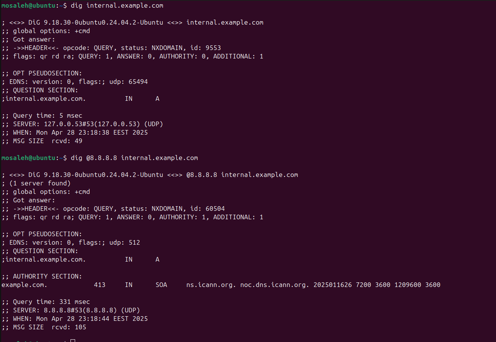

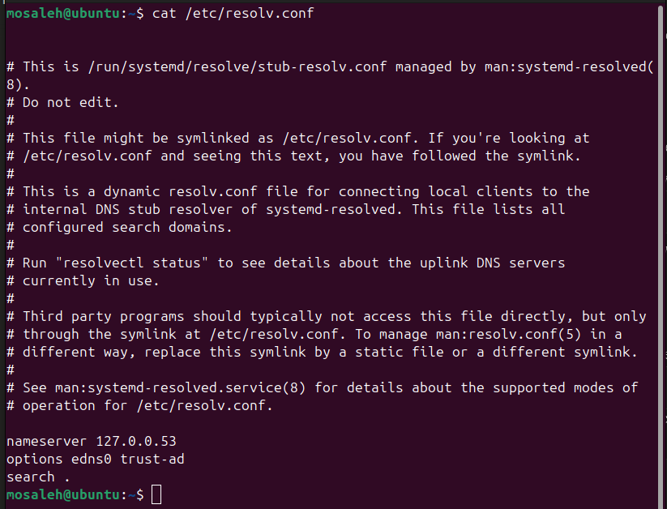

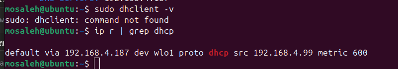

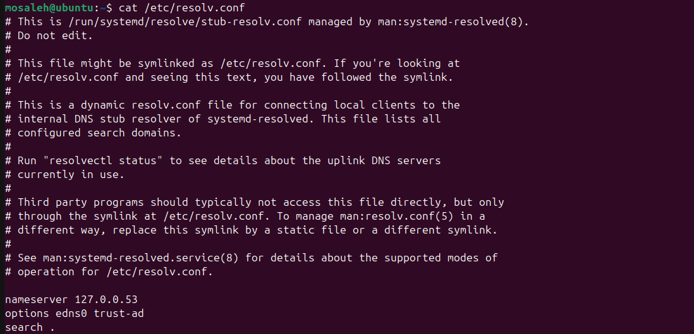

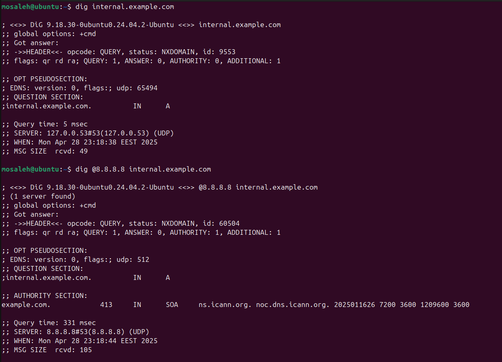

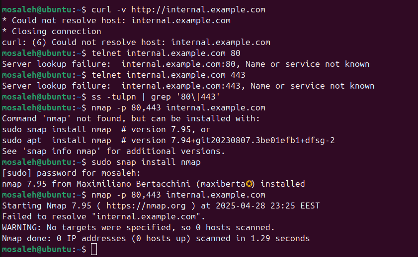

